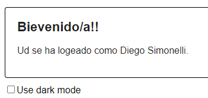
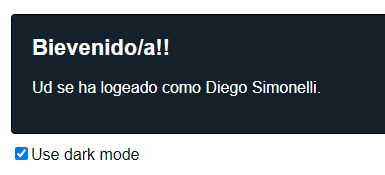

# Ejercicio 2- Context
>Consigna: Se deberá agregar el código faltante para que el app pueda logear al usuario con datos ingresados desde un formulario. También el usuario deberá poder optar por el dark mode.

>Consigna 2: Una vez que tenga el app funcionando, deberá dividirla en  diferentes componentes.  

